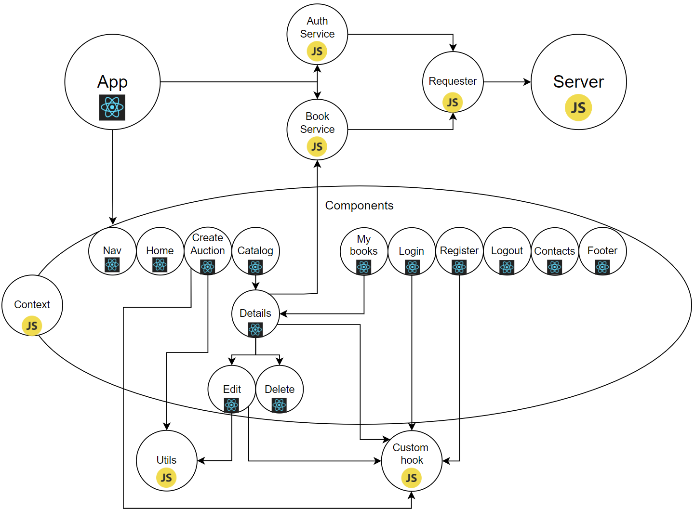

# Book-auction

## Content
- [Description](#description)
- [Architecture](#architecture)
- [Installation](#installation)

## Description
Welcome to my Book Auction Platform - a dynamic and secure online space for book enthusiasts! This platform seamlessly blends the excitement of auctions with the world of literature, offering a feature-rich experience for both buyers and sellers.

### Key Features:
1. User Authentication:
    - Login: Only registered users can place bets and add comments to book auctions.
    - Register: Open to everyone, allowing easy access to the platform.

2. Auction Management:
    - Create Book Auctions: Exclusive to registered users, empowering them to list their books for auction.
    - Edit/Delete Auctions: Sellers can modify or remove auctions, provided no bets have been placed and they are the auction owner.

3. Bidding and Interaction:
    - Place Bets: Only logged-in users can participate in the bidding process, adding an element of competition.
    - Add Comments: Engage in conversations about your favorite books with fellow readers.

4. Explore Books:
    - Browse Books: Unregistered users have the freedom to explore the diverse collection of book auctions.

## Architecture


## Installation

1. Clone the repository
```
git clone https://github.com/ioannaratayova/Book-auction.git
```

2. Navigate to the project
```
cd Book-auction
```

3. Start the server (this server is provided by SoftUni for educational purpose only)
```
node ./server/server.js
```
4. Open another terminal and navigate to the same folder

5. Navigate to the client folder
```
cd client
```
6. Install the dependencies
```
npm install
```
7. Start the React application
```
npm run dev
```
8. Now you can access the application on [http://localhost:5173/](http://localhost:5173/)
